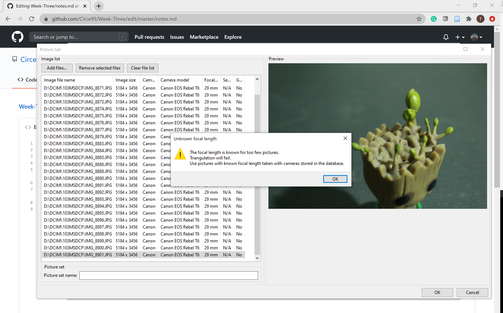
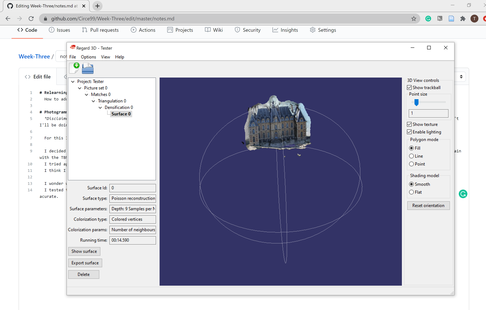

# Relearning Stuff
  How to add an image and link to my github [Link](https://discord.com/channels/739577555325157407/739577555849445376/760164394067296276)
  
  To add the image I had to put them in the main part of my repo instead of in my evidence folder so I am not sure if that's something I can fix at the moment

# Photogrammetry
  *Disclaimer* I am starting this week super late due to poor time management on my part (apologies for that) so I will do my best to do all of this week's work, but if I can't I'll be doing it during the Consolidation Pause. Here it goes!
  
  For this I will use my Canon Rebel T6
  
  I decided to try Regard3 - So I plugged in about 30 image of my little turtle and the first test did not work. I got this error message  so I tried again with the TBMR button clicked 
  I tried again with my Groot figurine, which worked even less than the turtle. 
  I think I will need more photos of my objects to get a better result so I will try that next. 
  
  I wonder what the largest object I can successfully model is? I'd love to test that out during the Consolidation Week too! 
  I tested the Sceaux Castle to see if I could get a better result (which answered my question abpve partially) but it does seem that my theory on number of photos may not be acurate. So it worked partially, but seemed to have forgotten the back. 
  
  Today I am trying Groot again with a new set of images, but I still get the same error message. I ended up with yet another indecipherable image. Maybe I will try with cellphone pictures next week to see if it is my camera that is causing the issues.
  
  I asked in the group if anyone else was experiencing the same issues as me, and Josh P sent me this [Link](https://github.com/shawngraham/hist3812w18/wiki/How-do-I-add-metadata-to-my-own-pictures%3F-I-know-I-need-this-to-use-Regard3d-to-make-my-model) which I will try first next week to see if that helps remove my error message. 
  

  
  
